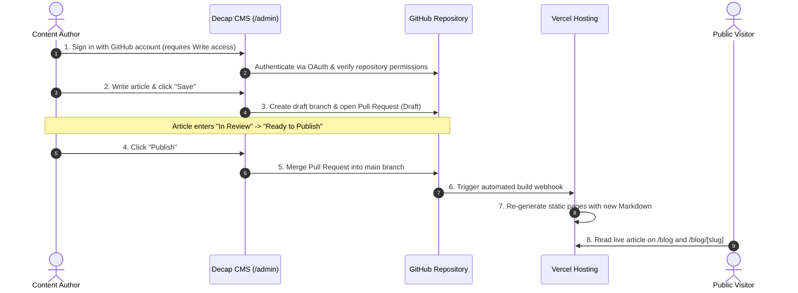

# Decap CMS & Blog Integration

## 1. Overview & Architectural Decision

This module integrates [Decap CMS](https://decapcms.org/) as a Git-based headless Content Management System for creating, editing, and publishing blog articles on the BITDOT platform.

### Architectural Decision: Git-Based Headless CMS

Instead of running a database-backed CMS server (such as WordPress or Strapi), the platform uses Decap CMS with GitHub as the content backend.

### Key Advantages

- **Zero Database Overhead**: Content is stored directly as Markdown files in `src/content/blog` and static images in `public/uploads`. No database management, migrations, or database hosting costs are required.
- **Security & Zero PII**: Content management requires no public database ports or third-party cloud data stores. Raw HTML rendering is disabled to prevent stored XSS.
- **Auditability & Version Control**: Every article draft, revision, and publication is tracked through Git commits and GitHub Pull Requests.
- **Static Generation & CDN Speed**: Published articles are pre-rendered at build time by Next.js using `generateStaticParams()`, ensuring fast load times and strong SEO performance.

> [!NOTE]
> Current UI layouts in `src/app/blog/page.tsx` and `src/app/blog/[slug]/page.tsx` are **functional prototypes** built to verify repository querying, markdown rendering, and YouTube embeds. The front-end team will refine final styling, category filtering, and visual layout.

---

## 2. Business & Editorial Workflow (Step-by-Step)

This section explains how content authoring works from login to publication, detailing what authors experience and what occurs automatically behind the scenes.



### Step 1: Login & Access Permission

- **Who can log in?**
  Authors access the CMS by navigating to `/admin` in any web browser and clicking **Login with GitHub**.
- **Permission requirement**:
  The user's GitHub account **must have Collaborator (Write) access** to the project repository. If an unauthorized user attempts to sign in, GitHub denies access and Decap CMS will not open.
- **Under the hood**:
  The application uses GitHub OAuth with PKCE security (`/api/cms/auth` and `/api/cms/callback`). Once verified, Decap securely receives an authorization token to interact with the repository on the author's behalf.

### Step 2: Content Creation & Editing

- After logging in, the author enters the **BITDOT Content Manager** dashboard.
- Clicking **Blog** displays all existing articles. Clicking **New Blog** opens the article editor.
- The editor provides clear, structured fields:
  - **Title**: The headline of the article.
  - **Summary (Excerpt)**: A 1–2 sentence summary displayed on card previews and search engines.
  - **Category**: A required selection from 5 agreed topics (`Career Development`, `AI and Automation`, `AI Governance`, `Executive and Board`, `AI Risk`).
  - **Publish Date**: The date and time of publication.
  - **YouTube URL** _(Optional)_: An optional video link that automatically embeds a responsive video player.
  - **Body**: The full article text using a rich-text or Markdown editor, with support for uploading images (saved automatically to `public/uploads/`).

### Step 3: What Happens When Clicking "Save" (Draft State)

- When an author clicks **Save**:
  - The article is saved as a **Draft**.
  - **Important**: The article is **NOT live on the public website** yet.
  - **Under the hood**:
    1. Decap CMS compiles the form into a Markdown file with YAML front matter (`src/content/blog/YYYY-MM-DD-slug.md`).
    2. Decap calls the GitHub API to create a new Git branch (e.g., `cms/blog/YYYY-MM-DD-slug`).
    3. Decap opens a **Draft Pull Request (PR)** on GitHub targeting the main branch.
    4. In the CMS dashboard, the article appears under the **Workflow** tab in the **Drafts** column.

### Step 4: Editorial Review Process ("In Review" → "Ready")

- In production, Decap operates in **Editorial Workflow** mode:
  - Team members can review the draft, read the content, and suggest edits.
  - In the CMS **Workflow** tab, the article card can be dragged across three stages:
    1. **Drafts**: Work in progress.
    2. **In Review**: Ready for team review.
    3. **Ready to Publish**: Approved and waiting to go live.
  - Every update made in the CMS automatically pushes a new commit to the draft branch on GitHub.

### Step 5: What Happens When Clicking "Publish" (Going Live)

- When an authorized user clicks **Publish**:
  - **Under the hood**:
    1. Decap CMS calls GitHub to **merge the Pull Request** into the main branch.
    2. Decap automatically closes and deletes the temporary draft branch.
    3. GitHub sends a webhook notification to **Vercel**.
    4. Vercel automatically runs `next build`, reads all Markdown files in `src/content/blog/`, and pre-renders static HTML pages for `/blog` and `/blog/[slug]`.
    5. Within 1–2 minutes, the article goes live and is immediately visible to the public.

### Step 6: Local Development Alternative (For Developers)

- During local development, developers run:
  - Terminal 1: `pnpm dev` (starts Next.js on `localhost:3000`)
  - Terminal 2: `pnpm cms` (starts local Decap proxy server on port 8081)
- In local mode, clicking **Save** or **Publish** writes directly to the local disk (`src/content/blog/`) without creating GitHub branches or pull requests, allowing instant previewing.

---

## 3. Implementation Architecture

```text
src/
├── features/cms/              # CMS configuration & OAuth engine
│   ├── config.ts              # Decap YAML generator & environment validator
│   ├── config.test.ts         # Configuration unit tests
│   ├── oauth.ts               # GitHub OAuth, PKCE S256 & token exchange
│   └── oauth.test.ts          # OAuth flow unit tests
├── features/blog/             # Blog repository & content logic
│   ├── types.ts               # BlogArticle & BlogCategory types
│   ├── repository.ts          # listBlogArticles, getBlogArticle (gray-matter)
│   ├── repository.test.ts     # Content parsing & validation tests
│   ├── youtube.ts             # YouTube privacy-enhanced embed URL parser
│   └── youtube.test.ts        # Video ID extraction tests
├── content/blog/              # Markdown article repository
└── app/
    ├── admin/route.ts         # Decap CMS SPA loader (/admin)
    ├── api/cms/               # CMS API endpoints (auth, callback, config)
    └── blog/                  # Public blog routes (/blog & /blog/[slug])
```

### Security Controls

- **PKCE OAuth**: Authenticates via GitHub OAuth with PKCE S256 code challenge and timing-safe state comparison.
- **Markdown Sanitization**: `ReactMarkdown` with `remarkGfm` converts Markdown safely without executing arbitrary HTML scripts.
- **Privacy-Enhanced Video Embeds**: YouTube URLs are transformed into `https://www.youtube-nocookie.com/embed/<id>` with strict referrer policy.
- **Strict Slug Validation**: Slugs must be lowercase alphanumeric with hyphens (`/^[a-z0-9]+(?:-[a-z0-9]+)*$/`).

---

## 4. Front-end Integration Guide

### 4.1 Consuming Blog Articles in Components

```typescript
import { listBlogArticles, getBlogArticle } from "@/features/blog/repository";
import { getYouTubeEmbedUrl } from "@/features/blog/youtube";
import { blogCategories, type BlogArticle } from "@/features/blog/types";

// 1. Fetch all published articles (sorted newest first)
const articles = await listBlogArticles();

// 2. Fetch a single article by slug
const article = await getBlogArticle(
  "2026-08-20-five-questions-before-adopting-ai",
);

// 3. Extract privacy-friendly YouTube embed URL
const embedUrl = getYouTubeEmbedUrl(article?.youtubeUrl);
```

### 4.2 Rendering Articles in Next.js Pages

#### Blog List Page (`src/app/blog/page.tsx`)

```tsx
import Link from "next/link";
import { listBlogArticles } from "@/features/blog/repository";

export default async function BlogPage() {
  const articles = await listBlogArticles();

  return (
    <div className="article-grid">
      {articles.map((article) => (
        <article key={article.slug} className="article-card">
          <span className="badge">{article.category}</span>
          <h2>{article.title}</h2>
          <p>{article.excerpt}</p>
          <time>
            {new Date(article.publishedAt).toLocaleDateString("en-AU")}
          </time>
          <Link href={`/blog/${article.slug}`}>Read Article →</Link>
        </article>
      ))}
    </div>
  );
}
```

#### Article Detail Page (`src/app/blog/[slug]/page.tsx`)

```tsx
import { notFound } from "next/navigation";
import ReactMarkdown from "react-markdown";
import remarkGfm from "remark-gfm";
import { getBlogArticle, listBlogArticles } from "@/features/blog/repository";

export async function generateStaticParams() {
  const articles = await listBlogArticles();
  return articles.map(({ slug }) => ({ slug }));
}

export default async function ArticlePage({
  params,
}: {
  params: Promise<{ slug: string }>;
}) {
  const { slug } = await params;
  const article = await getBlogArticle(slug);
  if (!article) notFound();

  return (
    <article className="prose">
      <span className="category">{article.category}</span>
      <h1>{article.title}</h1>
      <p className="lead">{article.excerpt}</p>

      {/* Markdown Body */}
      <ReactMarkdown remarkPlugins={[remarkGfm]}>{article.body}</ReactMarkdown>
    </article>
  );
}
```

### 4.3 Front-end Team Handover Checklist

- [ ] **Design Tokens & Typography**: Apply unified brand styling, responsive font sizes, and prose spacing to the article body.
- [ ] **Category Filtering**: Implement category filter tabs using `blogCategories` on `/blog`.
- [ ] **Image Styling**: Ensure uploaded images (`/uploads/*`) are styled with responsive max-width and rounded borders.
- [ ] **Video Container**: Ensure iframe video embeds maintain a 16:9 aspect ratio (`aspect-video`).
- [ ] **Admin Route**: Access `/admin` to preview the Decap editor interface.

---

## 5. Testing & Verification

### 5.1 Automated Tests

```bash
# Run CMS and blog test suites (13 unit tests)
pnpm test src/features/blog src/features/cms

# Run project-wide type checking and build
pnpm typecheck
pnpm build
```

**Test Coverage:**

- `repository.test.ts` (3 tests): Verifies YAML front matter parsing, missing required fields validation, and slug sorting.
- `youtube.test.ts` (2 tests): Tests YouTube URL parsing for standard, short, and embed formats into `youtube-nocookie.com`.
- `config.test.ts` (4 tests): Tests Decap YAML generation, repository string validation, origin URL normalisation, and production publish mode.
- `oauth.test.ts` (4 tests): Tests PKCE code challenge generation, timing-safe state comparison, and missing environment variable error handling.

### 5.2 Manual Verification Checklist

1. **Local CMS Workflow**:
   - Start Next.js dev server: `pnpm dev`
   - In a second terminal, start the local CMS proxy: `pnpm cms`
   - Open `http://localhost:3000/admin/` in the browser.
   - Create a new test article under **Blog**, fill in title, category, published date, and markdown body, then click **Publish**.
   - Confirm a new `.md` file is created in `src/content/blog/`.
   - Open `http://localhost:3000/blog` and verify the new article appears in the list.
2. **Article Page & Media Rendering**:
   - Click into the newly created article.
   - Verify formatting (headings, lists, bold text) renders cleanly via `ReactMarkdown`.
   - If a YouTube link was provided, verify the video player loads and plays.
   - If an image was uploaded, verify it displays correctly from `/uploads/`.
3. **Invalid Slug & Edge Cases**:
   - Navigate to `/blog/non-existent-slug` -> Verify it renders the custom 404 page.
